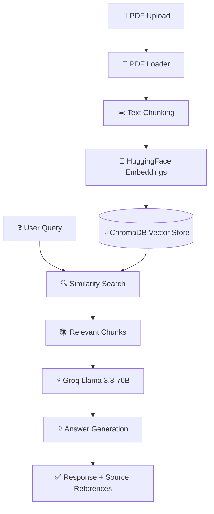

# 📄 PDF Q&A Chatbot — RAG Powered AI


# 🏗️ Architecture

## System Architecture



---

## 🔄 RAG Workflow

### 1️⃣ Document Upload
The user uploads a PDF through the Streamlit interface.

```python
uploaded_file = st.file_uploader(
    "Upload PDF",
    type=["pdf"]
)
```

### 2️⃣ PDF Processing
The PDF is loaded and text is extracted.

```python
loader = PyPDFLoader(pdf_path)
documents = loader.load()
```

### 3️⃣ Text Chunking
The extracted text is divided into smaller chunks for efficient retrieval.

```python
text_splitter = RecursiveCharacterTextSplitter(
    chunk_size=1000,
    chunk_overlap=200
)

chunks = text_splitter.split_documents(documents)
```

### 4️⃣ Embedding Generation
Each chunk is converted into vector embeddings using HuggingFace.

```python
embeddings = HuggingFaceEmbeddings(
    model_name="sentence-transformers/all-MiniLM-L6-v2"
)
```

### 5️⃣ Vector Storage
Embeddings are stored inside ChromaDB.

```python
vectorstore = Chroma.from_documents(
    chunks,
    embeddings
)
```

### 6️⃣ Retrieval
When a user asks a question, relevant chunks are retrieved using semantic similarity search.

```python
retriever = vectorstore.as_retriever(
    search_kwargs={"k": 4}
)
```

### 7️⃣ LLM Response Generation
Retrieved chunks and the user query are sent to Groq's Llama 3.3 model.

```python
llm = ChatGroq(
    model_name="llama-3.3-70b-versatile"
)
```

### 8️⃣ Final Response
The model generates a context-aware answer grounded in the uploaded PDF and displays source references.

---

## 📊 Data Flow

```text
PDF Upload
    │
    ▼
Text Extraction
    │
    ▼
Chunk Creation
    │
    ▼
Embedding Generation
    │
    ▼
ChromaDB Storage
    │
    ▼
User Question
    │
    ▼
Similarity Search
    │
    ▼
Relevant Chunks
    │
    ▼
Groq Llama 3.3
    │
    ▼
Answer + Sources
```

---

## 🛠️ Technologies Used

| Layer | Technology |
|---------|------------|
| Frontend | Streamlit |
| Framework | LangChain |
| LLM | Groq (Llama 3.3-70B) |
| Embeddings | HuggingFace all-MiniLM-L6-v2 |
| Vector Database | ChromaDB |
| PDF Parsing | PyPDF |
| Programming Language | Python |

---

## 🎯 Why RAG?

Traditional LLMs rely only on pre-trained knowledge and may hallucinate.  
This project uses **Retrieval-Augmented Generation (RAG)** to:

- ✅ Reduce hallucinations
- ✅ Improve factual accuracy
- ✅ Ground responses in uploaded documents
- ✅ Provide source-backed answers
- ✅ Enable private document interaction
